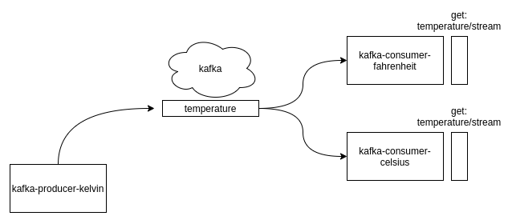

# PoC kafka-liberty

Aplicação demo usando open liberty, kafka e jee.

A PoC consiste em uma aplicação produtora (kafka-producer) e uma aplicação consumidora (kafka-consumer).

A aplicação produtora gera temperaturas randômicas em kelvin e as aplicações consumidoras convertem essa temperatura para celsius/fahrenheit e disponibilizam os resutados em um serviço rest.

## Subindo a aplicação

#### 1- Kafka
É possivel subir/derrubar o kafka através dos scripts start-kafka.sh e stop-kafka.sh respectivamente. (docker e docker-compose são usados aqui)

#### 2- Kelvin producer
Para subir a aplicação que irá gerar os eventos use /kafka-producer/kelvin.sh

#### 3- Celsius/Fahrenheit consumer
Para subir as aplicações que irão consumir os eventos use /kafka-consumer/celsius.sh e /kafka-consumer/fahrenheit.sh respectivamente.

#### 4- View
É possível usar o endpoint rest (get:temperature/stream) através do navegador para acompanhar os resutados. 

http://127.0.0.1:9081/index.html (celsius)

http://127.0.0.1:9082/index.html (fahrenheit)